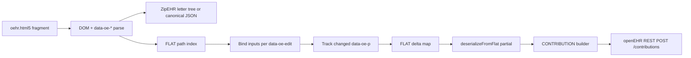

# oehr.html5/v1 — Semantic HTML5 openEHR narrative format

**Status:** proposed (not implemented)  
**Format URI:** `http://purl.org/ehrtslib/oehr/html5/v1`  
**Related:** [`README.md`](README.md) (`zipehr.xhtml/v1`), [`ROADMAP.md`](../../../ROADMAP.md) (Contribution builder), [`docs/SIMPLIFIED_FORMATS.md`](../../../docs/SIMPLIFIED_FORMATS.md)

## Purpose

`oehr.html5/v1` is a **reversible, compact, HTML5-native** serialisation of openEHR RM instance trees. It targets the same use cases as `zipehr.xhtml/v1` (human-readable narrative, FHIR `Narrative.div` embedding, browser rendering) but is designed from the start for **JavaScript hydration**: bind editors, track edits, and feed a client-side **contribution builder** that can emit valid openEHR `CONTRIBUTION` payloads to REST CDRs.

Where `zipehr.xhtml/v1` encodes semantics mainly in `class` and `title` (XHTML-era patterns), `oehr.html5/v1` uses:

- **Semantic HTML5 elements** (`article`, `section`, `dl`, `data`, `time`, …)
- **`data-oe-*` attributes** as a stable, parseable machine layer
- **ZipEHR terse value grammar** (unchanged) for lossless round-trip of coded and typed values

The format is a *skin* over canonical openEHR JSON — same information contract as ZipEHR JSON/YAML, different wire syntax.

## Design goals

| Goal | Approach |
|------|----------|
| HTML5 purist | Prefer native elements over generic `div`/`span`; headings reflect document outline |
| Compact | Short `data-oe-*` keys; omit inferrable metadata; optional minified emission |
| openEHR semantics | RM types, archetype ids, node ids, template id, terse DV values — all recoverable |
| Hydratable | Every editable leaf has `data-oe-p` (template path) and/or `data-oe-v` (canonical terse value) |
| Contribution-ready | Edits map to FLAT-path deltas → RM patch → `VERSION` in a `CONTRIBUTION` (see [Hydration & contribution builder](#hydration--contribution-builder)) |
| FHIR-safe | Fragment embeddable in FHIR R4 `Narrative.div` (HTML subset; no `script`/`iframe`/…) |

## Non-goals (v1)

- Replacing FLAT/STRUCTURED JSON for API transport (those remain the primary machine interchange formats)
- Full in-browser template validation UI (hydration contract only; widgets are app-specific)
- Multi-user CRDT/OT (future ROADMAP phase; v1 defines stable node identity hooks)

## Relationship to other formats

```
Canonical JSON (_type)
    ├─ zipehr.json / zipehr.yaml     … LLM/human compact tree
    ├─ zipehr.xhtml/v1               … FHIR narrative (class + title encoding)
    └─ oehr.html5/v1                 … semantic HTML + data-oe-* (this document)
            ↕ deserialize
    FLAT paths (when Web Template known) … contribution builder deltas
```

| | zipehr.xhtml/v1 | oehr.html5/v1 |
|---|---|---|
| Document flavour | XHTML namespace on root `div` | HTML5 fragment (`article` root) |
| RM type | `class="OB"` on `div` | `data-oe-t="OB"` on semantic container |
| LOCATABLE metadata | `title="te: …; ar: …; rm: …; id: …"` | separate `data-oe-te`, `data-oe-a`, `data-oe-rm`, `data-oe-n` |
| Scalar values | `span` text + optional `title` terse | `<data value="…">` or `<time datetime="…">` |
| ELEMENT | `div.E` + label `span` + value `span` | `<dl data-oe-t="E">` + `<dt>` / `<dd>` |
| Edit hooks | none | `data-oe-p`, `data-oe-v`, `data-oe-edit` |
| Path to contribution | indirect (deserialize → RM → FLAT) | direct path via `data-oe-p` when template-bound |

Letter-code RM aliases reuse [`symbol_table.yaml`](symbol_table.yaml) / Ehrbase short codes ([`ehrbase-short-codes.md`](ehrbase-short-codes.md)).

## Document shell

### Root

```html
<article data-oe-fmt="http://purl.org/ehrtslib/oehr/html5/v1" lang="en">
  …
</article>
```

- **`data-oe-fmt`** — format version URI (required on root). Deserializers warn if missing.
- **`lang`** — composition language (BCP 47), from `COMPOSITION.language` when present.
- Root RM type is always **`CO`** (COMPOSITION); implied by `article`, still set explicitly as `data-oe-t="CO"`.

### FHIR `Narrative.div` embedding

FHIR expects XHTML-ish HTML inside `div`. For interoperability:

```json
{
  "status": "generated",
  "div": "<div xmlns=\"http://www.w3.org/1999/xhtml\">…article…</div>"
}
```

The inner `article` keeps HTML5 semantics; the outer wrapper satisfies FHIR. Deserializers strip the wrapper if present.

### Forbidden content

Same safety set as `zipehr.xhtml/v1`: no `script`, `link`, `iframe`, `object`, `form`, `head`, `body`. Forms for editing are attached by the host app *around* or *onto* the fragment, not serialised inside it.

## Machine layer: `data-oe-*` attributes

Short prefix **`oe`** = openEHR. All attributes are optional except where noted.

| Attribute | Meaning | Example |
|-----------|---------|---------|
| `data-oe-fmt` | Format URI | root only |
| `data-oe-t` | RM type letter code | `OB`, `E`, `q`, `c`, `dt` |
| `data-oe-n` | `archetype_node_id` | `at0004` |
| `data-oe-a` | `archetype_details.archetype_id` | `openEHR-EHR-OBSERVATION.body_weight.v2` |
| `data-oe-te` | `archetype_details.template_id` | `ChemoForm-MBA.v7` |
| `data-oe-rm` | `archetype_details.rm_version` | `1.1.0` |
| `data-oe-v` | Terse canonical value (ZipEHR grammar) | `local::at0028\|Fully clothed, without shoes\|` |
| `data-oe-p` | Web Template / FLAT path (when known) | `vital_signs/body_weight:0/weight\|magnitude` |
| `data-oe-edit` | Suggested editor kind (hydration hint) | `text`, `coded`, `quantity`, `datetime`, `readonly` |

### LOCATABLE metadata rules

Same compaction rules as ZipEHR structured LOCATABLE objects:

1. Human-visible **name** always in the nearest heading or `<dt>` (never only in attributes).
2. Emit `data-oe-te`, `data-oe-a`, `data-oe-rm` when present in `archetype_details`.
3. Omit `data-oe-a` when it equals the visible name / template title.
4. Emit `data-oe-n` when it differs from `data-oe-a`, or when no archetype id is present.
5. Do **not** duplicate metadata in `title` — unlike `zipehr.xhtml/v1`.

### Terse values

Reuse ZipEHR terse grammar from [`README.md`](README.md#terse-data-values-what-strings-mean):

| DV type | Terse form | HTML5 carrier |
|---------|------------|---------------|
| `DV_TEXT` | plain text | text content; omit `data-oe-v` if identical |
| `DV_CODED_TEXT` | `term::code\|value\|` | `data-oe-v` on `<dd>` or `<data>` |
| `DV_QUANTITY` | `magnitude\|unit\|` | `<data value="85\|kg\|">` |
| `DV_DATE_TIME` | ISO-8601 string | `<time datetime="…">` + matching `data-oe-v` if needed |
| `CODE_PHRASE` | `term::code` | `data-oe-v` |

Display text stays human-friendly; machine form lives in `value` / `datetime` / `data-oe-v`.

## Semantic structure map

RM containers map to HTML5 landmarks; children follow RM property order where practical.

| RM type | Element | Heading | Notes |
|---------|---------|---------|-------|
| `COMPOSITION` | `<article>` | `<h1>` or `<h2>` | Root only |
| `SECTION` | `<section>` | `<h2>`–`<h4>` | Nested under composition |
| `OBSERVATION` | `<section>` | `<h3>` | `data-oe-t="OB"` |
| `EVALUATION` | `<section>` | `<h3>` | `EV` |
| `INSTRUCTION` | `<section>` | `<h3>` | `IN` |
| `ACTION` | `<section>` | `<h3>` | `AN` |
| `ADMIN_ENTRY` | `<section>` | `<h3>` | `AE` |
| `CLUSTER` | `<section>` | `<h4>`–`<h5>` | May nest |
| `HISTORY` | `<section>` | optional `<h4>` | `HI`; events as nested sections |
| `POINT_EVENT` / `INTERVAL_EVENT` | `<section>` | optional | `PE` / `IE` |
| `ITEM_TREE` / `ITEM_LIST` / … | `<section>` | optional | `TR`, `IL`, … |
| `ELEMENT` | `<dl>` | — | `<dt>` = name, `<dd>` = value |
| `EVENT_CONTEXT` | `<section>` | `<h3>` | `EC` |
| Scalar DV | `<dd>`, `<data>`, `<time>` | — | Inside ELEMENT or property slot |

**Definition lists for ELEMENT** align with HTML5 semantics: a term (`<dt>`) and description/value (`<dd>`). This is more native than `div` + `span` pairs and styles well with default UA CSS.

### Property slots without RM containers

When a parent RM object has a single scalar property (e.g. `EVENT_CONTEXT.start_time`), emit a compact **property row**:

```html
<p data-oe-t="EC" data-oe-prop="start_time">
  <time datetime="2024-01-15T10:30:00Z" data-oe-t="dt">15 Jan 2024, 10:30 UTC</time>
</p>
```

`data-oe-prop` records the RM attribute name when the element is not an RM container. Deserializers use `PROPERTY_TYPE_MAP` + `data-oe-prop` to reattach children.

## Example: body weight observation

Canonical source: [openEHR-EHR-OBSERVATION.body_weight.v2](https://ckm.openehr.org/ckm/archetypes/openEHR-EHR-OBSERVATION.body_weight.v2) — 85 kg, clothing state *Fully clothed, without shoes* (`at0028`).

```html
<article data-oe-fmt="http://purl.org/ehrtslib/oehr/html5/v1" data-oe-t="CO" lang="en">
  <section data-oe-t="OB" data-oe-a="openEHR-EHR-OBSERVATION.body_weight.v2">
    <h2>Body weight</h2>
    <section data-oe-t="HI">
      <section data-oe-t="PE" data-oe-n="at0003">
        <section data-oe-t="TR" data-oe-n="at0001">
          <dl data-oe-t="E" data-oe-n="at0004"
              data-oe-p="body_weight/weight:0|magnitude">
            <dt>Weight</dt>
            <dd data-oe-t="q" data-oe-edit="quantity">
              <data value="85|kg|">85 kg</data>
            </dd>
          </dl>
        </section>
        <section data-oe-t="TR" data-oe-n="at0008">
          <dl data-oe-t="E" data-oe-n="at0009"
              data-oe-p="body_weight/state_of_dress:0|code">
            <dt>State of dress</dt>
            <dd data-oe-t="c"
                data-oe-v="local::at0028|Fully clothed, without shoes|"
                data-oe-edit="coded">
              Fully clothed, without shoes
            </dd>
          </dl>
        </section>
      </section>
    </section>
  </section>
</article>
```

## Example: composition header (template-bound)

```html
<article data-oe-fmt="http://purl.org/ehrtslib/oehr/html5/v1"
         data-oe-t="CO"
         data-oe-te="ChemoForm-MBA.v7"
         data-oe-a="openEHR-EHR-COMPOSITION.self_reported_data.v1"
         data-oe-rm="1.1.0"
         lang="sv">
  <h1>ChemoForm-MBA.v7</h1>
  <section data-oe-t="EC">
    <p data-oe-prop="start_time">
      <time datetime="2023-08-31T16:31:16Z" data-oe-t="dt">31 Aug 2023 18:31</time>
    </p>
  </section>
  …
</article>
```

## Compact emission profile

For minimal bytes (mobile, bandwidth-sensitive narrative):

| Technique | Saving |
|-----------|--------|
| Omit `data-oe-v` when equal to text/`value`/`datetime` | avoids duplicate strings |
| Omit `data-oe-t` on `<dd>` when inferrable from parent `data-oe-prop` + `PROPERTY_TYPE_MAP` | **deserialize only** with parent context |
| Single-line emission (no insignificant whitespace) | wire size |
| Omit headings when name is empty and `data-oe-n` is sufficient | rare edge case |

Pretty-printed emission is the default for authoring; compact profile is opt-in (`prettyPrint: false`).

## Hydration & contribution builder

This section defines the **contract** for client-side JavaScript. Implementation belongs in a future `enhanced/contribution/` (or demo) module per [ROADMAP.md](../../../ROADMAP.md) *Phase X — Contribution builder* (Beale et al., [*openEHR Architecture Overview*](https://link.springer.com/article/10.1186/1472-6947-13-57)).

### Node identity

A hydrated field is uniquely addressed by:

```
(data-oe-p)  OR  (dom path of data-oe-t + data-oe-n chain)
```

When a **Web Template** was used at serialise time, prefer `data-oe-p` — it aligns with FLAT keys and the contribution builder’s change list (Table 2 in the paper: versions, commits, audited changes).

### Suggested hydration algorithm



1. **Parse** — walk DOM; build RM subtree (same inverse as deserializer).
2. **Index** — collect all `[data-oe-p]` nodes.
3. **Bind** — by `data-oe-edit`:
   - `text` → `contenteditable` or `<input type="text">`
   - `quantity` → magnitude + unit controls; write back `magnitude|unit|` to `<data value>`
   - `coded` → terminology picker; write `term::code|value|` to `data-oe-v` + label text
   - `datetime` → `<input type="datetime-local">`; sync `datetime` attribute
   - `readonly` → no binding
4. **Dirty tracking** — on change, set `data-oe-changed=""` (empty boolean attribute) and store original in `data-oe-orig` (hydrator-only; not serialised back).
5. **Submit** — gather dirty paths → FLAT delta → merge into full FLAT via Web Template → `deserializeFromFlat` → wrap in `ORIGINAL_VERSION` → `CONTRIBUTION`.

### Minimum DOM hooks for editable v1

| Hook | Required when | Purpose |
|------|---------------|---------|
| `data-oe-p` | template known | stable change path |
| `data-oe-v` or `<data value>` | coded / non-text | lossless round-trip |
| `data-oe-edit` | user-editable fields | widget selection |
| `data-oe-changed` | after edit | dirty flag (runtime only) |

Server-side contribution builder runs the same pipeline without DOM — useful for HTML uploaded as a document artefact.

### Relationship to ENTRY.provider

Future multi-user editing (ROADMAP *multiuser contribution builder*) can map `data-oe-changed-by` (runtime) to openEHR `ENTRY.provider` on commit. v1 leaves provider attribution to the contribution audit trail (`AUDIT_DETAILS.committer`).

## Deserialization

Inverse of serialisation:

1. Locate root `article[data-oe-fmt]` (or FHIR wrapper `div` → `article`).
2. Walk semantic tree; read `data-oe-t` → RM type via letter-code reverse map.
3. Rebuild LOCATABLE fields from `data-oe-n` / `data-oe-a` / `data-oe-te` / `data-oe-rm` + heading/dt text.
4. For each value leaf: prefer `data-oe-v`, else `<data value>`, else `<time datetime>`, else text content → terse expand → canonical DV.
5. Assign children using `data-oe-prop` when set, else `PROPERTY_TYPE_MAP` + child RM type (same algorithm as `xhtml_deserialize.ts`).
6. `expandZipehrToCanonical` → canonical JSON.

Unknown `data-oe-t` → hard error (extensibility requires format version bump).

## Serialisation API (planned)

Mirror existing ZipEHR exports:

```ts
// proposed — not yet implemented
serializeToOehrHtml5(canonical, { webTemplate?, prettyPrint?, lang? }): string
oehrHtml5ToCanonical(html: string): Promise<unknown>
hydrateOehrHtml5(fragment: string, options: HydrateOptions): HydratedView
collectFlatDeltas(hydrated: HydratedView): Record<string, unknown>
```

When `webTemplate` is supplied, emit `data-oe-p` on ELEMENT and scalar slots.

## Validation

- **HTML5**: tolerate browser HTML parser differences; serialised output should be XML-compatible where FHIR requires it (escape `<`, `&`, quotes in text/attributes).
- **Clinical**: HTML carries no validation guarantees — template validation runs after deserialize (existing `TemplateValidator`).
- **Security**: sanitize on ingest if accepting user HTML; strip forbidden tags.

## Versioning

- **v1** — initial proposal (this document).
- Breaking changes (attribute rename, element map change) → `…/v2` URI; deserializers may accept older URIs with explicit flag.

## Open questions

1. **`h1` vs `h2` at composition root** — `h1` for standalone pages, `h2` when embedded in FHIR/OAuth portals (profile flag?).
2. **ITEM_TABLE** — HTML `<table>` for tabular archetypes vs nested `<section>` (table is more native but heavier).
3. **Multimedia** — `<figure>` + `` vs `data-oe-v` URI only (size vs preview).
4. **ISM_TRANSITION** — state machine as `<ol data-oe-t="IT">` or dedicated microformat.

## Summary

`oehr.html5/v1` trades XHTML `class`/`title` encoding for **semantic HTML5 structure** plus an explicit **`data-oe-*` machine layer**. It stays compact by reusing ZipEHR terse values and LOCATABLE compaction rules, while adding **FLAT-path hooks** (`data-oe-p`) and **editor hints** (`data-oe-edit`) so a browser-side contribution builder can hydrate the narrative, apply edits, and submit standards-compliant contributions without leaving the HTML document model.
