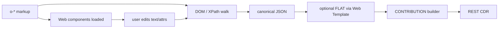

# ZipEHR HTML5 — compact custom-element formats

**Status:** proposed (not implemented)  
**Related:** [`README.md`](README.md), [`symbol_table.yaml`](symbol_table.yaml), [`ROADMAP.md`](../../../ROADMAP.md) (Contribution builder)

## Purpose

Three ZipEHR HTML5 wire formats serialise openEHR RM instance trees as **custom elements** (`o-*`) for:

- compact storage / LLM context
- **browser-readable clinical text without CSS** (names and values as element text)
- CSS / XPath / XQuery / DOM tree walk
- optional upgrade to web components for in-browser edit → contribution builder

Not constrained by FHIR Narrative. Prefer **attributes** for codes, ids, and machine fields; put **clinically relevant display strings in element text** so a bare HTML document is human-readable.

| Format URI | Tag dialect | Example tags |
|------------|-------------|--------------|
| `http://purl.org/ehrtslib/zipehr/html5/short/v1` | Ehrbase / `symbol_table` letter codes | `o-co`, `o-ob`, `o-e`, `o-q`, `o-c` |
| `http://purl.org/ehrtslib/zipehr/html5/full/v1` | RM class names, kebab-case | `o-composition`, `o-observation`, `o-element`, `o-dv-quantity` |
| `http://purl.org/ehrtslib/zipehr/html5/emoji/v1` | ZipEHR emoji symbols | `o-👀`, `o-🔹`, `o-🌡️`, `o-🗈` |

Same tree shape across dialects; tag local name after `o-` differs. Round-trip all ↔ canonical JSON via the shared ZipEHR symbol maps.

## Design goals

| Goal | Rule |
|------|------|
| Compress | Short dialect: minified wire, short attrs |
| Readable | LOCATABLE **names** and DV **values** render as **text** in the browser without CSS |
| Semantics | Every typed node is an `o-*` element; LOCATABLE + DV fields recoverable |
| Traversable | Parent/child = RM containment; siblings under multi-valued props use document order |
| No path strings | No FLAT/`data-oe-p`; paths inferred by walk + template/AOM if needed |
| Text-first clinical | Display names, rubrics, magnitudes, units, booleans → text (or nested text children) |
| Machine attrs | Archetype ids, codes, terminology ids, precision metadata → attributes |
| Hydrate later | Tags alone are storage; web components upgrade the same tags in apps |

## Non-goals

- FHIR `Narrative.div` compliance (use `zipehr.xhtml/v1` for that)
- Emitting FLAT paths or editor-kind hints in the stored document
- Minifying the **full** or **emoji** dialect (pretty-print is default there)

## Relationship to other ZipEHR skins

```
Canonical JSON (_type)
  ├─ zipehr.json / zipehr.yaml
  ├─ zipehr.xhtml/v1          … FHIR-safe (class + title)
  ├─ zipehr.html5/short/v1    … o-{letter}   (this doc)
  ├─ zipehr.html5/full/v1     … o-{rm-kebab} (this doc)
  └─ zipehr.html5/emoji/v1    … o-{emoji}    (this doc)
```

| | xhtml/v1 | html5 short/full/emoji |
|---|---|---|
| Elements | `div` / `span` | custom `o-*` |
| Type | `class="OB"` | tag `o-ob` / `o-observation` / `o-👀` |
| LOCATABLE name | heading / leading `span` text | **element text** (leading text node) |
| DV values | text + optional `title` | **element text** or nested text children |
| Metadata | `title="te:…; ar:…"` | short or full RM attrs |
| Paths | — | none (traverse) |

## Tag names

Custom elements require a hyphen → always `o-…`. HTML parsers fold ASCII tag names to lowercase; emoji suffixes are case-stable.

### Short dialect (`html5/short`)

Letter codes from [`symbol_table.yaml`](symbol_table.yaml) / [`ehrbase-short-codes.md`](ehrbase-short-codes.md), lowercased, with **HTML5 collision overrides** from `html5_short_tags`:

| RM type | Tag | Notes |
|---------|-----|-------|
| COMPOSITION | `o-co` | |
| SECTION | `o-se` | |
| OBSERVATION | `o-ob` | |
| EVALUATION | `o-ev` | |
| INSTRUCTION | `o-in` | |
| ACTION | `o-an` | |
| ADMIN_ENTRY | `o-ae` | |
| EVENT_CONTEXT | `o-ec` | |
| HISTORY | `o-hi` | |
| POINT_EVENT | `o-pe` | |
| INTERVAL_EVENT | `o-ie` | |
| ITEM_TREE | `o-tr` | |
| ITEM_LIST | `o-il` | |
| CLUSTER | `o-cl` | |
| ELEMENT | `o-e` | |
| DV_QUANTITY | `o-q` | |
| DV_CODED_TEXT | `o-c` | |
| DV_TEXT | `o-x` | |
| DV_BOOLEAN | `o-b` | |
| DV_COUNT | `o-cnt` | override: `co` collides with `COMPOSITION` |
| DV_DATE | `o-d` | |
| DV_TIME | `o-t` | |
| DV_DATE_TIME | `o-dt` | |
| CODE_PHRASE | `o-cp` | override: `C` collides with `DV_CODED_TEXT` |
| DV_INTERVAL | `o-intv` | override: `iv` collides with `INTERVAL` |
| DV_PARSABLE | `o-pars` | override: `pa` collides with `PARTICIPATION` |
| DV_PROPORTION | `o-prop` | override: `pr` collides with `PARTY_RELATED` |
| DV_URI | `o-uri` | override: `u` collides with `UUID` |

Serializer resolves tag suffix as: `SYMBOL_TABLE_HTML5_SHORT_TAGS[type] ?? letterCode.toLowerCase()`. Reverse map is table-driven (see generated `SYMBOL_TABLE_HTML5_SHORT_TAGS` in [`symbol_table.ts`](symbol_table.ts)).

### Full dialect (`html5/full`)

`o-` + RM class lowercased with `_` → `-`:

| RM type | Tag |
|---------|-----|
| COMPOSITION | `o-composition` |
| OBSERVATION | `o-observation` |
| POINT_EVENT | `o-point-event` |
| ITEM_TREE | `o-item-tree` |
| ELEMENT | `o-element` |
| DV_QUANTITY | `o-dv-quantity` |
| DV_CODED_TEXT | `o-dv-coded-text` |
| DV_DATE_TIME | `o-dv-date-time` |
| CODE_PHRASE | `o-code-phrase` |

No letter-code collisions; more bytes; better for human inspection and CSS without lookup tables. **Default output is pretty-printed** (indented, line breaks). **Attribute names use full openEHR RM names** (see below).

### Emoji dialect (`html5/emoji`)

Per [WHATWG HTML](https://html.spec.whatwg.org/dev/custom-elements.html), custom element local names may include Unicode (including emoji) when they:

- start with a lowercase ASCII letter,
- contain a hyphen (`o-` prefix satisfies both),
- contain no ASCII uppercase letters.

Therefore the emoji dialect uses `o-` + primary emoji from [`symbol_table.yaml`](symbol_table.yaml) (`SYMBOL_TABLE_EMOJI_SYMBOLS`):

| RM type | Tag |
|---------|-----|
| COMPOSITION | `o-🖂` |
| OBSERVATION | `o-👀` |
| ELEMENT | `o-🔹` |
| DV_QUANTITY | `o-🌡️` |
| DV_CODED_TEXT | `o-🗈` |
| ITEM_TREE | `o-🌳` |
| HISTORY | `o-📉` |

**Attribute names** may also use ZipEHR emoji keys where defined in `symbol_table.yaml` (`data_types.attributes`, `terminology_shortcuts`, `field_promotions`) — e.g. `🆔` for `archetype_node_id`, `Ⓐ` for `archetype_id`, `📍` for `local` terminology. Emoji attribute names are valid (no ASCII upper alpha). Clinical values still use **text content**, not emoji attrs, for browser readability.

Pretty-print is default (same as full). Use emoji dialect when aligning visually with `zipehr.json` / `zipehr.yaml`.

### Detect dialect

- Root has `fmt` attribute (see below), or
- Inspect first `o-*` suffix: short letter token (`o-ob`), kebab RM name (`o-observation`), or emoji (`o-👀`).

## Browser-readable text (all dialects)

### LOCATABLE names

Emit `LOCATABLE.name.value` as the **leading text** of the element (before child elements). Do **not** rely on a `na` / `name` attribute for display — attributes are fallback for deserialization when text is stripped.

```html
<o-e n="at0004">Weight
  <o-q><mag>85</mag><unit>kg</unit></o-q>
</o-e>
```

Full dialect uses the RM attribute name on the element and full nested tags:

```html
<o-element archetype-node-id="at0004">Weight
  <o-dv-quantity>
    <magnitude>85</magnitude>
    <units>kg</units>
  </o-dv-quantity>
</o-element>
```

If the name is structured (rare), nest a typed `DV_TEXT` child instead of raw text.

### DV values as text

| Type | Text content | Attributes (machine) |
|------|----------------|----------------------|
| `DV_TEXT` | `value` | — |
| `DV_CODED_TEXT` | rubric (`value`) | `terminology_id`, `code_string` (short: `t`, `c`) |
| `CODE_PHRASE` | omit (code-only) or code as text | `terminology_id`, `code_string` |
| `DV_BOOLEAN` | `true` / `false` (or `1` / `0`) | optional `value` mirror |
| `DV_DATE` / `DV_TIME` / `DV_DATE_TIME` | ISO-8601 string | optional `value` mirror |
| `DV_DURATION` | ISO-8601 duration | optional `value` mirror |
| `DV_COUNT` | magnitude as text | optional `magnitude` attr |
| `DV_URI` / `DV_EHR_URI` | URI string | — |
| `DV_IDENTIFIER` | `id` text | `issuer`, `assigner`, `type` as needed |

### `DV_QUANTITY` — nested magnitude and unit

Use child elements so magnitude and unit are visible without CSS or XPath:

**Short dialect** — abbreviated child tags:

```html
<o-q>
  <mag>85</mag>
  <unit>kg</unit>
</o-q>
```

When the unit has a **display name** distinct from the unit id, put the display string in text and the unit id in an attribute:

```html
<o-q>
  <mag>1.2</mag>
  <unit u="[mg_per_dl]">mg/dL</unit>
</o-q>
```

**Full dialect** — RM child tag names:

```html
<o-dv-quantity>
  <magnitude>1.2</magnitude>
  <units u="[mg_per_dl]">mg/dL</units>
</o-dv-quantity>
```

**Emoji dialect** — same RM child names as full (clinical facts stay literal text):

```html
<o-🌡️>
  <magnitude>85</magnitude>
  <units>kg</units>
</o-🌡️>
```

Rules:

1. `<mag>` / `<magnitude>` text = numeric magnitude (always).
2. `<unit>` / `<units>`: if display ≠ unit id → text = display, `u` attribute = unit id; else text = unit id and omit `u`.
3. Optional RM fields (`accuracy`, `precision`, `normal_status`, …) remain attributes on the DV element (full RM names in full/emoji dialects).
4. Do not duplicate magnitude/unit as attributes when nested children are present.

### `DV_PROPORTION`

Nested text children in short dialect: `<num>`, `<den>`; full dialect: `<numerator>`, `<denominator>`. Kind and precision as attributes (`proportion-kind`, `precision` in full dialect).

## Attribute vocabulary

### Short dialect (`html5/short`)

Global HTML attrs used as usual: `lang` on root. Prefer these over `data-*` to save bytes.

| Attr | RM / meaning | When emitted |
|------|----------------|--------------|
| `fmt` | format URI or short token `s1` / `f1` / `e1` | root only |
| `n` | `archetype_node_id` | at-codes and ids |
| `a` | `archetype_details.archetype_id` | when present |
| `tp` | `archetype_details.template_id` | composition / root when present |
| `rm` | `archetype_details.rm_version` | when present |
| `p` | RM property name on parent | **only** when child type ↔ property is ambiguous |
| `t` | terminology id | coded types |
| `c` | code string | coded types |
| `u` | unit id on `<unit>` child only | when display text differs from id |

**Do not** emit `na` / `name` for display when name text is present (text is authoritative for rendering).

Terminology shortcuts (optional): `t=local` / `t=openehr` written literally; emoji terminology shortcuts (`📍`, `🌬️`) are for the **emoji dialect** only.

### Full dialect (`html5/full`)

Use **full openEHR RM attribute names** (kebab-case in HTML). Pretty-printed by default.

| Attr | RM attribute |
|------|----------------|
| `archetype-node-id` | `LOCATABLE.archetype_node_id` |
| `archetype-id` | `ARCHETYPED.archetype_id` |
| `template-id` | `ARCHETYPED.template_id` |
| `rm-version` | `ARCHETYPED.rm_version` |
| `terminology-id` | `CODE_PHRASE.terminology_id` / coded text |
| `code-string` | `CODE_PHRASE.code_string` |
| `language` | `COMPOSITION.language` |
| `territory` | `COMPOSITION.territory` |
| `encoding` | `COMPOSITION.encoding` |
| `property` | parent RM property when inference is ambiguous |

Value fields that appear as nested text children (`magnitude`, `units`, `numerator`, …) are **not** duplicated as attributes.

### Emoji dialect (`html5/emoji`)

Use emoji attribute keys from `symbol_table.yaml` wherever defined:

| Emoji attr | RM meaning |
|------------|------------|
| `🆔` | `archetype_node_id` |
| `Ⓐ` | `archetype_id` |
| `Ⓣ` | `template_id` |
| `⚙️` | `rm_version` |
| `📍` / `🌬️` / `🗪` / `🌐` / `🔤` | terminology / composition promotions |

Coded values: terminology emoji + `code-string` text child or attribute as appropriate. Clinical rubrics remain **text** inside the DV element.

## Tree shape & inference

1. Element tag ⇒ RM `_type`.
2. Children are RM properties: assign using `PROPERTY_TYPE_MAP[parent][childType]` (same as `xhtml_deserialize`). Array properties (`content`, `items`, `events`, …) → sibling order = list order.
3. Emit `p` / `property` only when two siblings would map to the same property or type is polymorphic without unique match (rare).
4. No wrapper for “property slots”: the typed child *is* the slot (`o-ec` under `o-co` ⇒ `context`).
5. Omit empty optional containers.
6. Leading text node (after trim) on LOCATABLE elements ⇒ `name.value`.

## Root

Short dialect (compact wire):

```html
<o-co fmt="s1" lang="en" tp="Vital Signs" a="openEHR-EHR-COMPOSITION.encounter.v1" rm="1.1.0">Vital Signs
  …
</o-co>
```

Short `fmt` tokens:

| Token | URI |
|-------|-----|
| `s1` | `…/zipehr/html5/short/v1` |
| `f1` | `…/zipehr/html5/full/v1` |
| `e1` | `…/zipehr/html5/emoji/v1` |

Deserializers accept full URI or token.

## Worked example (body weight)

Same clinical content as ZipEHR README / CKM body_weight.v2.

### Short dialect — compact (minified wire)

```html
<o-ob fmt="s1" a="openEHR-EHR-OBSERVATION.body_weight.v2">Body weight<o-hi><o-pe n="at0003"><o-tr n="at0001"><o-e n="at0004">Weight<o-q><mag>85</mag><unit>kg</unit></o-q></o-e></o-tr><o-tr n="at0008"><o-e n="at0009">State of dress<o-c t="local" c="at0028">Fully clothed, without shoes</o-c></o-e></o-tr></o-pe></o-hi></o-ob>
```

### Short dialect — pretty (debug)

```html
<o-ob fmt="s1" a="openEHR-EHR-OBSERVATION.body_weight.v2">Body weight
  <o-hi>
    <o-pe n="at0003">
      <o-tr n="at0001">
        <o-e n="at0004">Weight
          <o-q><mag>85</mag><unit>kg</unit></o-q>
        </o-e>
      </o-tr>
      <o-tr n="at0008">
        <o-e n="at0009">State of dress
          <o-c t="local" c="at0028">Fully clothed, without shoes</o-c>
        </o-e>
      </o-tr>
    </o-pe>
  </o-hi>
</o-ob>
```

### Full dialect (pretty-print default)

```html
<o-observation fmt="f1" archetype-id="openEHR-EHR-OBSERVATION.body_weight.v2">Body weight
  <o-history>
    <o-point-event archetype-node-id="at0003">
      <o-item-tree archetype-node-id="at0001">
        <o-element archetype-node-id="at0004">Weight
          <o-dv-quantity>
            <magnitude>85</magnitude>
            <units>kg</units>
          </o-dv-quantity>
        </o-element>
      </o-item-tree>
      <o-item-tree archetype-node-id="at0008">
        <o-element archetype-node-id="at0009">State of dress
          <o-dv-coded-text terminology-id="local" code-string="at0028">Fully clothed, without shoes</o-dv-coded-text>
        </o-element>
      </o-item-tree>
    </o-point-event>
  </o-history>
</o-observation>
```

### Emoji dialect (pretty-print default)

```html
<o-👀 fmt="e1" Ⓐ="openEHR-EHR-OBSERVATION.body_weight.v2">Body weight
  <o-📉>
    <o-🞋 🆔="at0003">
      <o-🌳 🆔="at0001">
        <o-🔹 🆔="at0004">Weight
          <o-🌡️>
            <magnitude>85</magnitude>
            <units>kg</units>
          </o-🌡️>
        </o-🔹>
      </o-🌳>
      <o-🌳 🆔="at0008">
        <o-🔹 🆔="at0009">State of dress
          <o-🗈 📍="at0028">Fully clothed, without shoes</o-🗈>
        </o-🔹>
      </o-🌳>
    </o-🞋>
  </o-📉>
</o-👀>
```

Note: emoji dialect may place `code-string` as text with terminology emoji attr (`📍="at0028"`) parallel to ZipEHR terse strings.

### Compact short (drop display names)

If names are loaded from archetype terminology at hydrate time:

```html
<o-ob fmt="s1" a="openEHR-EHR-OBSERVATION.body_weight.v2"><o-hi><o-pe n="at0003"><o-tr n="at0001"><o-e n="at0004"><o-q><mag>85</mag><unit>kg</unit></o-q></o-e></o-tr><o-tr n="at0008"><o-e n="at0009"><o-c t="local" c="at0028"/></o-e></o-tr></o-pe></o-hi></o-ob>
```

Lossless for codes + magnitudes; display labels restored from AOM / terminology.

## CSS / XPath (traversal without paths)

```css
o-ob o-e[n="at0004"] o-q mag { font-weight: bold; }
o-c[c="at0028"] { color: green; }
```

```xpath
//o-e[@n='at0004']/o-q/mag/text()
//o-c[@t='local' and @c='at0028']/text()
count(//o-pe)
```

Full dialect: `o-observation`, `o-element`, `archetype-node-id`, …  
Emoji dialect: `o-👀`, `o-🔹`, `@🆔`, …

Sibling index for repeating nodes (contribution delta):  
`nth-child` / preceding-sibling count among same tag under the same parent property — inferred at walk time, not stored.

## Compression checklist (emit rules)

### Short dialect (`s1`)

1. **Minify** by default: no insignificant whitespace/newlines.
2. Omit LOCATABLE name text when app will resolve from archetype.
3. Omit `a` when equal to template root / already on ancestor.
4. Omit `p` whenever property inference is unique.
5. Prefer explicit close tags for DV leaves in HTML paste contexts: `<o-q>…</o-q>`.
6. Never emit FLAT paths or `data-oe-edit`.
7. Never duplicate nested text values as attributes.

### Full (`f1`) and emoji (`e1`) dialects

1. **Pretty-print** by default (indented, one logical block per line).
2. Full RM attribute names (full) or emoji attrs (emoji).
3. Same text-first rules for names and DV values.
4. No minification unless `prettyPrint: false` explicitly requested.

## Hydration & contribution builder

Storage = inert custom tags. In a webapp, register web components with the same local names (or a single upgrade script).



- **Addressing:** reconstructed path from ancestor tags + `n`/`🆔`/`archetype-node-id` + sibling indices (no stored `data-oe-p`).
- **Dirty:** runtime only; do not persist editor chrome.
- **Submit:** walk → RM → (optional) FLAT merge → `ORIGINAL_VERSION` → `CONTRIBUTION` ([ROADMAP](../../../ROADMAP.md)).

## Deserialization sketch

1. Parse as HTML/XML fragment; require root `o-*` with `fmt` if available.
2. Map tag → RM type (short map, kebab map, or emoji map).
3. Read leading text → `LOCATABLE.name.value`; read LOCATABLE attrs → node id / archetyped.
4. Read DV text children → typed fields (`mag`/`magnitude`, `unit`/`units`, rubric text, …).
5. Attach children via property inference (+ rare `p` / `property`).
6. Expand to canonical `_type` JSON.

## Planned API

```ts
serializeToZipehrHtml5(canonical, {
  dialect: "short" | "full" | "emoji",
  prettyPrint?: boolean, // default: false for short, true for full/emoji
}): string
zipehrHtml5ToCanonical(html: string): Promise<unknown>
// dialect auto-detected from fmt / tags
```

## Open questions

1. **Self-close vs explicit end tags** for HTML parse vs XML storage profile.
2. **Boolean text:** prefer `true`/`false` vs `1`/`0` in text nodes.
3. Whether **name-less** compact profile is a separate `fmt` token (`s1n`) or a serialize option.
4. **Emoji coded-text attrs:** single `📍` attr holding code vs separate terminology + code-string attrs.

## Summary

ZipEHR HTML5 replaces div/class narratives with **`o-*` custom elements** in three tag dictionaries (**letter**, **full RM kebab**, **emoji**). Clinically relevant **names and values render as HTML text** (with nested `magnitude` / `unit` children for quantities); machine ids and codes use attributes. Short dialect minifies for wire; full and emoji dialects pretty-print with full RM or emoji attribute names respectively. **No FLAT paths** — CSS/XPath and DOM walk reconstruct structure for hydration and contribution commit.
