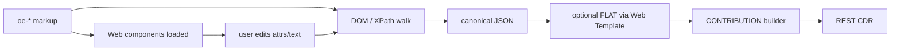

# ZipEHR HTML5 — compact custom-element formats

**Status:** proposed (not implemented)  
**Related:** [`README.md`](README.md), [`symbol_table.yaml`](symbol_table.yaml), [`ROADMAP.md`](../../../ROADMAP.md) (Contribution builder)

## Purpose

Two ZipEHR HTML5 wire formats serialise openEHR RM instance trees as **custom elements** (`oe-*`) for:

- compact storage / LLM context
- CSS / XPath / XQuery / DOM tree walk
- optional upgrade to web components for in-browser edit → contribution builder

Not constrained by FHIR Narrative. Prefer **attributes** for codes and typed fields; keep **text** only when it is the clinical display string (or omit display when derived later from terminology/archetype).

| Format URI | Tag dialect | Example tags |
|------------|-------------|--------------|
| `http://purl.org/ehrtslib/zipehr/html5/short/v1` | Ehrbase / `symbol_table` letter codes | `oe-co`, `oe-ob`, `oe-e`, `oe-q`, `oe-c` |
| `http://purl.org/ehrtslib/zipehr/html5/full/v1` | RM class names, kebab-case | `oe-composition`, `oe-observation`, `oe-element`, `oe-dv-quantity` |

Same attribute grammar and tree shape; only the local name after `oe-` differs. Round-trip both ↔ canonical JSON via the shared ZipEHR letter map.

## Design goals

| Goal | Rule |
|------|------|
| Compress | Short tags (short dialect), short attrs, omit inferrable noise |
| Semantics | Every typed node is an `oe-*` element; LOCATABLE + DV fields recoverable |
| Traversable | Parent/child = RM containment; siblings under multi-valued props use document order |
| No path strings | No FLAT/`data-oe-p`; paths inferred by walk + template/AOM if needed |
| Attribute-first | Codes, magnitudes, units, ISO times, ids → attributes |
| Hydrate later | Tags alone are storage; web components upgrade the same tags in apps |

## Non-goals

- FHIR `Narrative.div` compliance (use `zipehr.xhtml/v1` for that)
- Emitting FLAT paths or editor-kind hints in the stored document
- Pretty-print as default (minify for wire; pretty for debugging)

## Relationship to other ZipEHR skins

```
Canonical JSON (_type)
  ├─ zipehr.json / zipehr.yaml
  ├─ zipehr.xhtml/v1          … FHIR-safe (class + title)
  ├─ zipehr.html5/short/v1    … oe-{letter}   (this doc)
  └─ zipehr.html5/full/v1     … oe-{rm-kebab} (this doc)
```

| | xhtml/v1 | html5 short/full |
|---|---|---|
| Elements | `div` / `span` | custom `oe-*` |
| Type | `class="OB"` | tag `oe-ob` / `oe-observation` |
| Metadata | `title="te:…; ar:…"` | short attrs `a` `t` `r` `n` `na` |
| Values | text + optional `title` | attrs (`m` `u` `code` …) |
| Paths | — | none (traverse) |

## Tag names

Custom elements require a hyphen → always `oe-…`. HTML parsers fold names to lowercase.

### Short dialect (`html5/short`)

Letter codes from [`symbol_table.yaml`](symbol_table.yaml) / [`ehrbase-short-codes.md`](ehrbase-short-codes.md), lowercased:

| RM type | Tag |
|---------|-----|
| COMPOSITION | `oe-co` |
| SECTION | `oe-se` |
| OBSERVATION | `oe-ob` |
| EVALUATION | `oe-ev` |
| INSTRUCTION | `oe-in` |
| ACTION | `oe-an` |
| ADMIN_ENTRY | `oe-ae` |
| EVENT_CONTEXT | `oe-ec` |
| HISTORY | `oe-hi` |
| POINT_EVENT | `oe-pe` |
| INTERVAL_EVENT | `oe-ie` |
| ITEM_TREE | `oe-tr` |
| ITEM_LIST | `oe-il` |
| CLUSTER | `oe-cl` |
| ELEMENT | `oe-e` |
| DV_QUANTITY | `oe-q` |
| DV_CODED_TEXT | `oe-c` |
| DV_TEXT | `oe-x` |
| DV_BOOLEAN | `oe-b` |
| DV_COUNT | `oe-co`† |
| DV_DATE | `oe-d` |
| DV_TIME | `oe-t` |
| DV_DATE_TIME | `oe-dt` |
| CODE_PHRASE | `oe-cp`‡ |

† Letter `co` collides with COMPOSITION `CO` under case-folding. Prefer **`oe-cnt`** for `DV_COUNT` in the HTML5 short dialect (document this alias in the symbol table / serializer).  
‡ Letter `C` → use **`oe-cp`** for `CODE_PHRASE` so it does not collide with `oe-c` (`DV_CODED_TEXT`).

Serializer must emit these HTML5-safe aliases; reverse map is table-driven like existing letter codes.

### Full dialect (`html5/full`)

`oe-` + RM class lowercased with `_` → `-`:

| RM type | Tag |
|---------|-----|
| COMPOSITION | `oe-composition` |
| OBSERVATION | `oe-observation` |
| POINT_EVENT | `oe-point-event` |
| ITEM_TREE | `oe-item-tree` |
| ELEMENT | `oe-element` |
| DV_QUANTITY | `oe-dv-quantity` |
| DV_CODED_TEXT | `oe-dv-coded-text` |
| DV_DATE_TIME | `oe-dv-date-time` |
| CODE_PHRASE | `oe-code-phrase` |

No collisions; more bytes; better for human inspection and CSS without looking up codes.

### Detect dialect

- Root has `fmt` attribute (see below), or
- First `oe-*` name length / known token set (`oe-ob` vs `oe-observation`).

## Attribute vocabulary (shared)

Global HTML attrs used as usual: `lang` on root. Prefer these over `data-*` to save bytes.

| Attr | RM / meaning | When emitted |
|------|----------------|--------------|
| `fmt` | format URI or short token `s1` / `f1` | root only |
| `na` | `LOCATABLE.name.value` | when present and not equal to a sole identifiable code |
| `n` | `archetype_node_id` | at-codes and ids not equal to `a` |
| `a` | `archetype_details.archetype_id` | when present; omit if equal to `na` |
| `tp` | `archetype_details.template_id` | composition / root when present |
| `rm` | `archetype_details.rm_version` | when present |
| `p` | RM property name on parent | **only** when child type ↔ property is ambiguous |

### Value attributes by DV (attribute-first)

| Type | Attrs | Text content |
|------|-------|--------------|
| `DV_QUANTITY` | `m` magnitude, `u` units | omit (or optional display) |
| `DV_COUNT` | `m` | omit |
| `DV_PROPORTION` | `n` numerator, `d` denominator, `t` type, `p` precision† | omit |
| `DV_BOOLEAN` | `v` = `0`/`1` or empty/`true` | omit |
| `DV_TEXT` | — | text = value |
| `DV_CODED_TEXT` | `t` terminology_id, `c` code_string | optional rubric; or omit text if UI looks up |
| `CODE_PHRASE` | `t`, `c` | omit |
| `DV_ORDINAL` | `v` symbol value, `t`/`c` defining_code | optional |
| `DV_DATE` / `DV_TIME` / `DV_DATE_TIME` | `v` ISO-8601 | omit |
| `DV_DURATION` | `v` ISO-8601 duration | omit |
| `DV_URI` / `DV_EHR_URI` | `v` | omit |
| `DV_IDENTIFIER` | `id`, `type`, `issuer`, `assigner` as needed | omit |

† For `DV_PROPORTION`, do not reuse `n`/`p` if a LOCATABLE parent already reserved them — proportion fields live only on the DV leaf element: use `num` / `den` / `k` (proportion kind) / `prec` if collision risk. Prefer `num`/`den`/`k`/`prec` always for clarity at ~same cost.

**Do not** store ZipEHR terse strings as a second copy of the same fact. Either attrs (`t`+`c`) *or* a single terse `v` — prefer attrs for codes/quantities (more XPath-friendly: `oe-c[@c='at0028']`).

Terminology shortcuts (optional emission only): `t=local` / `t=openehr` written literally; emoji shortcuts stay in JSON/YAML ZipEHR, not HTML5.

### Composition promotions

Same idea as ZipEHR field promotions — attributes on `oe-co` / `oe-composition`:

| Attr | Meaning |
|------|---------|
| `lang` | language code (`en`) |
| `te` | territory (`SE`) |
| `enc` | encoding (`UTF-8`) when present |

## Tree shape & inference

1. Element tag ⇒ RM `_type`.
2. Children are RM properties: assign using `PROPERTY_TYPE_MAP[parent][childType]` (same as `xhtml_deserialize`). Array properties (`content`, `items`, `events`, …) → sibling order = list order.
3. Emit `p="…"` only when two siblings would map to the same property or type is polymorphic without unique match (rare).
4. No wrapper for “property slots”: the typed child *is* the slot (`oe-ec` under `oe-co` ⇒ `context`).
5. Omit empty optional containers.

### ELEMENT

```html
<oe-e n="at0004" na="Weight"><oe-q m="85" u="kg"/></oe-e>
```

Full dialect:

```html
<oe-element n="at0004" na="Weight"><oe-dv-quantity m="85" u="kg"/></oe-element>
```

Name in `na` (attribute), not a nested `oe-x`, unless name is structured (rare).

## Root

```html
<oe-co fmt="s1" lang="en" tp="Vital Signs" a="openEHR-EHR-COMPOSITION.encounter.v1" rm="1.1.0" na="Vital Signs">
  …
</oe-co>
```

Short `fmt` tokens:

| Token | URI |
|-------|-----|
| `s1` | `…/zipehr/html5/short/v1` |
| `f1` | `…/zipehr/html5/full/v1` |

Deserializers accept full URI or token.

## Worked example (body weight) — short, compact

Same clinical content as ZipEHR README / CKM body_weight.v2:

```html
<oe-ob fmt="s1" a="openEHR-EHR-OBSERVATION.body_weight.v2" na="Body weight"><oe-hi><oe-pe n="at0003"><oe-tr n="at0001"><oe-e n="at0004" na="Weight"><oe-q m="85" u="kg"/></oe-e></oe-tr><oe-tr n="at0008"><oe-e n="at0009" na="State of dress"><oe-c t="local" c="at0028">Fully clothed, without shoes</oe-c></oe-e></oe-tr></oe-pe></oe-hi></oe-ob>
```

Pretty (debug only):

```html
<oe-ob fmt="s1" a="openEHR-EHR-OBSERVATION.body_weight.v2" na="Body weight">
  <oe-hi>
    <oe-pe n="at0003">
      <oe-tr n="at0001">
        <oe-e n="at0004" na="Weight"><oe-q m="85" u="kg"/></oe-e>
      </oe-tr>
      <oe-tr n="at0008">
        <oe-e n="at0009" na="State of dress">
          <oe-c t="local" c="at0028">Fully clothed, without shoes</oe-c>
        </oe-e>
      </oe-tr>
    </oe-pe>
  </oe-hi>
</oe-ob>
```

### Full dialect (same tree)

```html
<oe-observation fmt="f1" a="openEHR-EHR-OBSERVATION.body_weight.v2" na="Body weight">
  <oe-history>
    <oe-point-event n="at0003">
      <oe-item-tree n="at0001">
        <oe-element n="at0004" na="Weight"><oe-dv-quantity m="85" u="kg"/></oe-element>
      </oe-item-tree>
      <oe-item-tree n="at0008">
        <oe-element n="at0009" na="State of dress">
          <oe-dv-coded-text t="local" c="at0028">Fully clothed, without shoes</oe-dv-coded-text>
        </oe-element>
      </oe-item-tree>
    </oe-point-event>
  </oe-history>
</oe-observation>
```

### Even smaller (drop display names)

If names are loaded from archetype terminology at hydrate time:

```html
<oe-ob fmt="s1" a="openEHR-EHR-OBSERVATION.body_weight.v2"><oe-hi><oe-pe n="at0003"><oe-tr n="at0001"><oe-e n="at0004"><oe-q m="85" u="kg"/></oe-e></oe-tr><oe-tr n="at0008"><oe-e n="at0009"><oe-c t="local" c="at0028"/></oe-e></oe-tr></oe-pe></oe-hi></oe-ob>
```

Lossless for codes + magnitudes; display labels restored from AOM / terminology.

## CSS / XPath (traversal without paths)

```css
oe-ob oe-e[n="at0004"] oe-q { font-weight: bold; }
oe-c[c="at0028"] { color: green; }
```

```xpath
//oe-e[@n='at0004']/oe-q/@m
//oe-c[@t='local' and @c='at0028']
count(//oe-pe)
```

Full dialect: replace `oe-ob` → `oe-observation`, `oe-e` → `oe-element`, etc.

Sibling index for repeating nodes (contribution delta):  
`nth-child` / preceding-sibling count among same tag under the same parent property — inferred at walk time, not stored.

## Compression checklist (emit rules)

1. Prefer **short** dialect for storage/bandwidth.
2. Minify: no insignificant whitespace/newlines.
3. Omit `na` when app will resolve from archetype.
4. Omit `a` when equal to template root / already on ancestor if nested archetype same as node id (keep `a` on root LOCATABLE that introduces the archetype).
5. Omit `p` whenever property inference is unique.
6. Self-close empty DV with only attrs: `<oe-q m="85" u="kg"/>` (XML-style in stored fragments; HTML parsers accept void custom elements inconsistently — prefer explicit close `<oe-q m="85" u="kg"></oe-q>` for HTML browser paste if needed; storage/XML mode may self-close).
7. Never emit FLAT paths or `data-oe-edit`.
8. Never duplicate typed value as text when attrs already carry it (`m`/`u`/`c`).

## Hydration & contribution builder

Storage = inert custom tags. In a webapp, register web components with the same local names (or a single upgrade script).



- **Addressing:** reconstructed path from ancestor tags + `n`/`a` + sibling indices (no stored `data-oe-p`).
- **Dirty:** runtime only (e.g. component state or transient attr); do not persist editor chrome.
- **Submit:** walk → RM → (optional) FLAT merge → `ORIGINAL_VERSION` → `CONTRIBUTION` ([ROADMAP](../../../ROADMAP.md)).

## Deserialization sketch

1. Parse as HTML/XML fragment; require root `oe-*` with `fmt` if available.
2. Map tag → RM type (short map or kebab→`DV_*`/`COMPOSITION`…).
3. Read LOCATABLE attrs → structured name / node id / archetyped.
4. Read DV attrs → typed fields; text → `DV_TEXT.value` or coded rubric.
5. Attach children via property inference (+ rare `p`).
6. Expand to canonical `_type` JSON.

## Planned API

```ts
serializeToZipehrHtml5(canonical, { dialect: "short" | "full", prettyPrint?: boolean }): string
zipehrHtml5ToCanonical(html: string): Promise<unknown>
// dialect auto-detected from fmt / tags
```

## Open questions

1. **Self-close vs explicit end tags** for HTML parse vs XML storage profile.
2. **`DV_COUNT` / `COMPOSITION` letter collision** — stick with `oe-cnt` vs reserve another letter in HTML5-only table.
3. **Boolean `oe-b`:** attribute `v="1"` vs presence of empty attr vs text `true`.
4. Whether **name-less** compact profile is a separate `fmt` token (`s1n`) or an serialize option.

## Summary

ZipEHR HTML5 replaces div/class narratives with **`oe-*` custom elements** in two tag dictionaries (**letter** vs **full RM kebab**). openEHR semantics sit in **tags + short attributes**; codes and quantities are attributes; display text is optional. **No FLAT paths** — CSS/XPath and DOM walk reconstruct structure for hydration and contribution commit.
